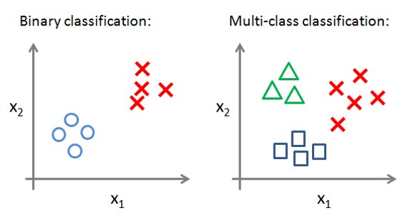
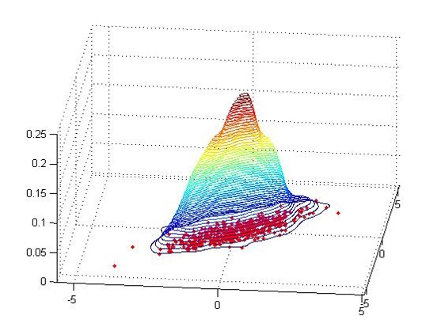

### 機器學習

* 監督式學習：Training model with labels
* 非監督式學習：Training model without labels
* 半監督式學習：Training model with partial labels
* 強化學習：Trial and Error

**模型：**

|  | **Continuous label** | **Discrete label** |
| :---: | :---: | :---: |
| **Supervised** | Regression | Classification |
| **Unsupervised** | Density estumation | Clustering |

**Classification：**

**Clustering：**

**Density Estimation：**

